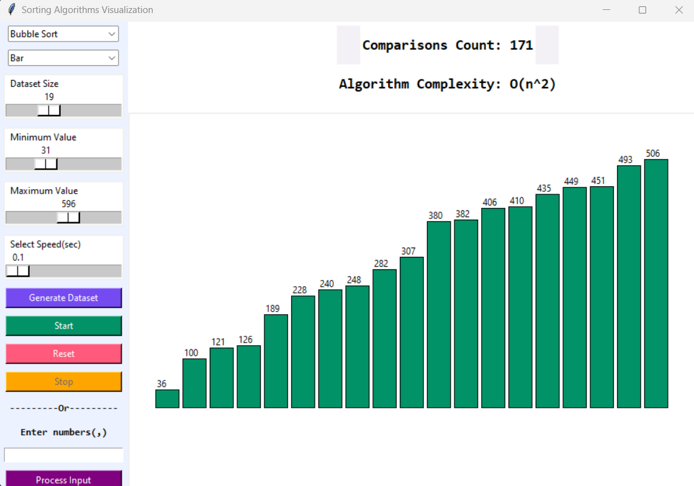
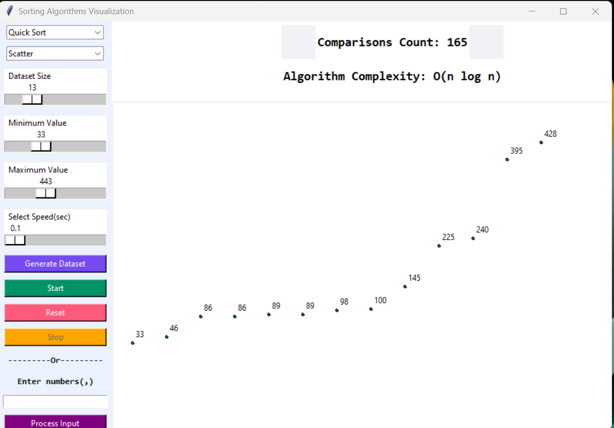
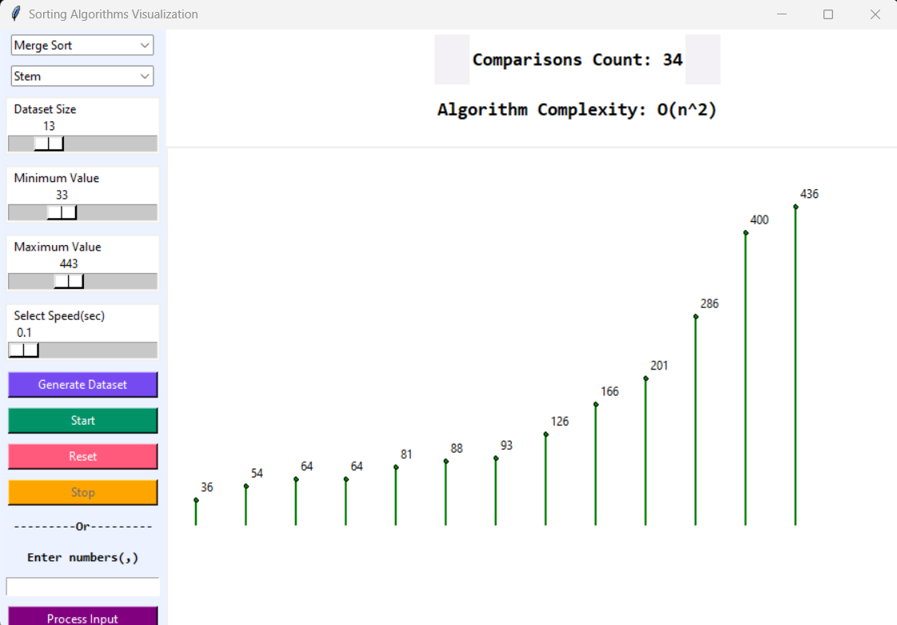

# Sorting Algorithms Visualization Python

A visualization tool for various sorting algorithms implemented in Python. See how different sorting algorithms work and how they perform on different datasets.

## Demo:

## Features

- 🎯 Visualize popular sorting algorithms, including Bubble Sort, Selection Sort, Insertion Sort, Merge Sort, Quick Sort, and more.
- 📊 Choose from various pre-defined datasets, including random, sorted, reversed, and nearly sorted data.
- ⏱️ Adjust the speed of the visualization to observe the sorting process in real-time or faster.
- ⏯️ Step through the sorting process one step at a time or let it run continuously.
- ⏸️ Pause, resume, and reset the visualization as needed.
- 🖥️ Interactive user interface to control the visualization.

## Prerequisites

- Python 3.10+ or higher
- Tkinter library (https://docs.python.org/3/library/tkinter.html)

## Getting Started:

1. Clone this repository to your local machine.
2. Install the required dependencies by running the following command:
   `pip install tkinter`
3. Run the program by executing the following command:
   `python main.py`
4. Use the user interface to select a sorting algorithm, dataset, and adjust the visualization settings.
5. Start the visualization and observe the sorting algorithm in action.

## Authors:

- Nazir Sharifi(@nazir20)
- Judy Nkwama(@judy-nkwama)
- Aslı Bozkurt(@asliBozkurt)

## Screenshots:

